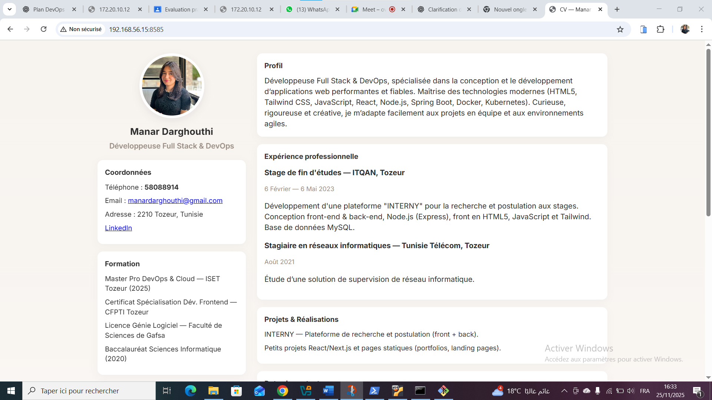
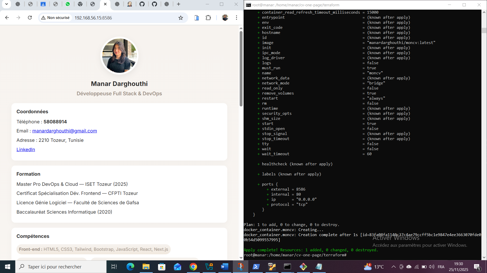
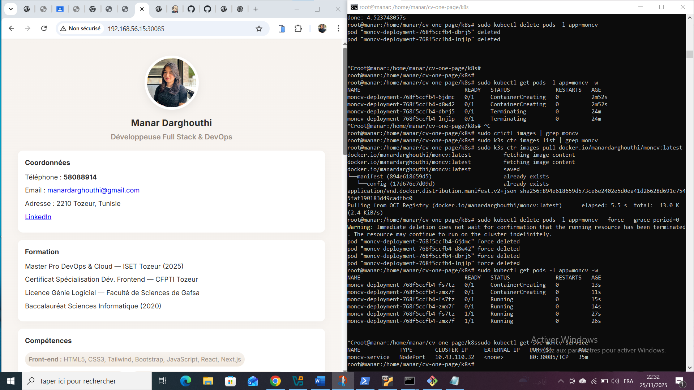
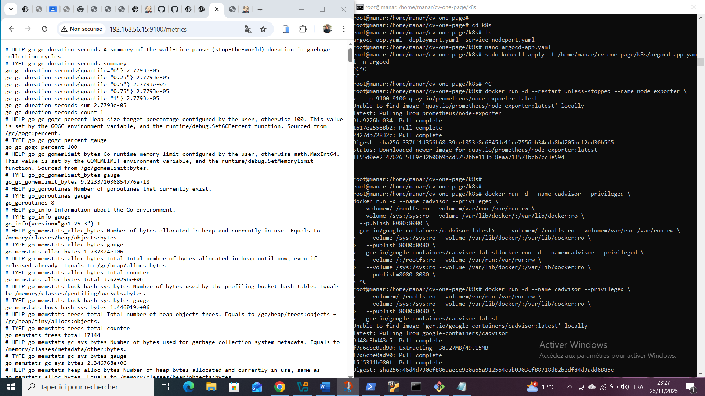

# CV One Page - Projet DevOps

Ce projet a pour objectif de déployer une **application statique CV One Page** en utilisant une **chaîne DevOps complète** : Ansible, Docker, Terraform, Kubernetes (K3s), Argo CD et Grafana Cloud.

---

## Table des matières

1. [Pré-requis](#pré-requis)
2. [Architecture du projet](#architecture-du-projet)
3. [Installation des outils](#installation-des-outils)
4. [Déploiement Docker avec Terraform](#déploiement-docker-avec-terraform)
5. [Déploiement Kubernetes avec K3s et Argo CD](#déploiement-kubernetes-avec-k3s-et-argo-cd)
6. [Monitoring avec Grafana Cloud](#monitoring-avec-grafana-cloud)
7. [Captures d’écran](#captures-décran)

---

## Pré-requis

- VM Ubuntu Server 24.04
- Accès root ou sudo
- SSH configuré
- Compte Docker Hub
- Git installé
- K3s installé sur la VM

---

## Architecture du projet

[CV One Page HTML/CSS] --> [Docker Image] --> [Docker Hub] --> [K3s Deployment] --> [Argo CD] --> [Grafana Cloud Monitoring]
---
## Installation des outils 
1.Docker
2.Terraform
3.Jenkins
4.K3s
---
## Déploiement Docker avec Terraform
1.Créer le fichier main.tf
2.Initialiser et appliquer Terraform
3.Vérifier le conteneur
---
## Déploiement Kubernetes avec K3s et Argo CD
1.Créer le deployment deployment.yaml
2.Créer le service service-nodeport.yaml
3.Appliquer les fichiers
4.Accéder à l’application  http://192.168.56.15:30085
---
## Monitoring avec Grafana CloudMonitoring avec Grafana Cloud
1.Créer un compte Grafana Cloud
2.Ajouter les datasources : Node Exporter pour VM, cAdvisor pour Docker, K3s metrics
3.Créer des dashboards pour visualiser l’état des pods, conteneurs et VM
---
## Captures d’écran
1.Conteneur Docker en fonctionnement

2.terraform

![terraform MonCV](les_captures/terraform1.png
3.Pods K3s en Running

4.node exporter

